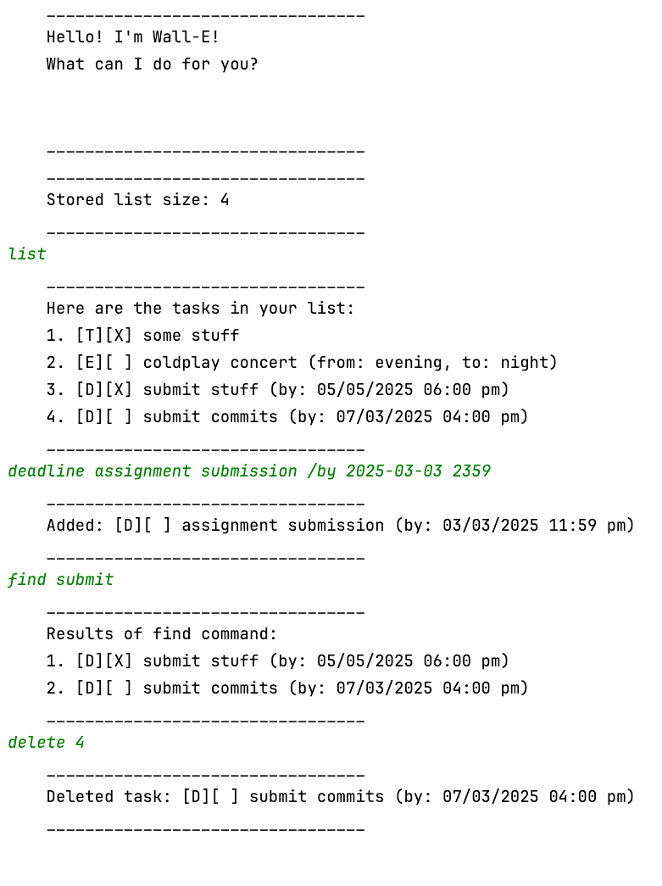

# Wall-E User Guide



**Product Overview**  
Wall-E is a task management application designed to help you organize and keep track of your tasks with ease.
You can add todo items, set deadlines, events, and mark tasks as done or not done. The app will save your tasks in a file and retrieve them when you restart it.

---
## Adding Todo Tasks

To add a todo task, simply use the `todo` command followed by the task description.

### Example: `todo mop the floor`

**Expected Outcome:**  
This will add a task called "mop the floor" and initialize it as incomplete. It has a "T" type to indicate it is a todo task.

```
added: [T][ ] mop the floor
```

---
## Adding Deadlines

To add a task with a deadline, simply use the `deadline` command followed by the task description and the due date and time.
The task command *expects* a valid date and time of the format yyyy-MM-dd HHmm in 24 hour format.

### Example: `deadline finish project /by 2025-03-10 1600`

**Expected Outcome:**  
This will add a task named "finish project" with the deadline of March 10, 2025, 4.00pm. It will be displayed in your task list with the type "D" for Deadline.

```
added: [D][ ] finish project (by: 2025-03-10 4.00 pm)
```

---
## Adding Events

You can add an event using the `event` command, providing the task description and the start and end dates.

### Example: `event team meeting /from 9am /to around 12pm`

**Expected Outcome:**  
This adds an event for "team meeting" that spans from "9am" to "around 12pm". Event does not differentiate between
real dates and text input.

```
added: [E][ ] team meeting (from: 2025-03-01, to: 2025-03-02)
```

---

## Marking Tasks as Done

You can mark any task as completed by using the `mark` command followed by the task number.

### Example: `mark 1`

**Expected Outcome:**  
The task with the specified number will be marked as done.

```
Nice! I've marked this task as done:
	[D][X] finish project (by: 2025-03-10)
```

---

## Unmarking Tasks

If you wish to unmark a task that was previously marked as done, use the `unmark` command followed by the task number.

### Example: `unmark 1`

**Expected Outcome:**  
The task will be unmarked as done.

```
OK, I've marked this task as not done yet:
	[D][ ] finish project (by: 2025-03-10)
```

---

## Deleting Tasks

If you no longer need a task, you can delete it using the `delete` command followed by the task number.

### Example: `delete 2`

**Expected Outcome:**  
The task with the specified index will be removed from the task list.

```
deleted task: [T][ ] Buy groceries
```

---

## Listing All Tasks

To view all the tasks currently in your list, use the `list` command.

### Example: `list`

**Expected Outcome:**  
This will display all the tasks currently stored in your list.

```
Here are the tasks in your list:
1. [D][ ] finish project (by: 2025-03-10)
2. [E][ ] team meeting (from: 2025-03-01, to: 2025-03-02)
```

---

## Find By Keyword or Phrase

To find tasks that contain some keyword or phrase, use the `find` command.

### Example: `find homework`

**Expected Outcome:**  
This will display tasks that contain the provided search term(s).

```
Results of find command:
1. [D][ ] do homework (by: 2025-03-10)
2. [E][ ] submit cs2113 homework (from: 2025-03-01, to: 2025-03-02)
```

---

## Exit the Application

To close the Wall-E application and save your tasks, use the `bye` command.

### Example: `bye`

**Expected Outcome:**  
Wall-E will save the tasks to the file and print an exit message.

```
Saved data to data.txt
Bye. Hope to see you again soon!
```

---

This is your guide to using the Wall-E application. Enjoy organizing your tasks with ease!
